# **DaoAI World SDK C++ 环境配置**

## **1. 安装最新版 DaoAI World SDK**
请参考以下链接：  
[DW_SDK Windows 安装包 — DaoAI World User Manual 2024.8 documentation](http://docs.welinkirt.com/daoai-world-user-manual/latest/develop/install.html#)

---
## **C++ 项目参考**
参考项目：`DW_SDK_Cpp_Example`

### **代码使用步骤**
1. **打开项目**  
使用Visual Studio打开 `DW_SDK_Cpp_Example.sln`
   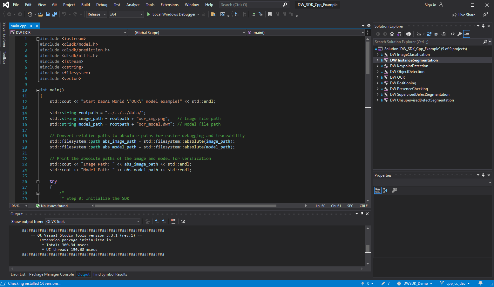

下载 [Data](https://daoairoboticsinc-my.sharepoint.com/:f:/g/personal/nrd_daoai_com/ElXWeD4qcbFLkto-NhXxgmsBlIEZ0G5iKVtdV_N0yPWfiQ?e=ViNAAL) 下的 data.zip 并解压到根目录。

选择 Release x64，选择一个启动项目，然后运行。
   

## **QT项目参考**
参考项目：`DW_SDK_Qt_Example`

### **代码使用步骤**
1. **打开项目**  
   打开 QtCreator，选择“打开已有项目”，并选中 `DW_SDK_Qt_Example` 下的 `CMakeLists.txt` 文件。  
   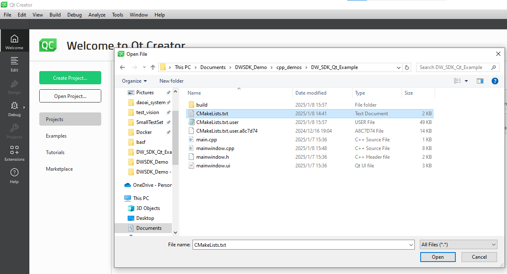

2. **配置项目**  
   确保 Build 模式为 **Release**。  
   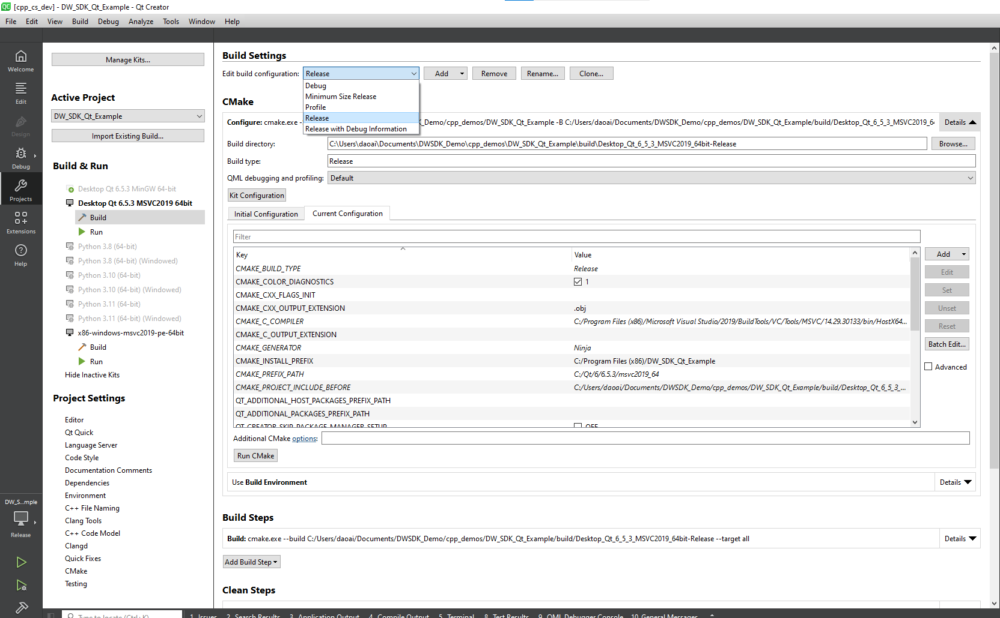

3. **运行项目**  
   点击“运行”，开始运行项目。  
   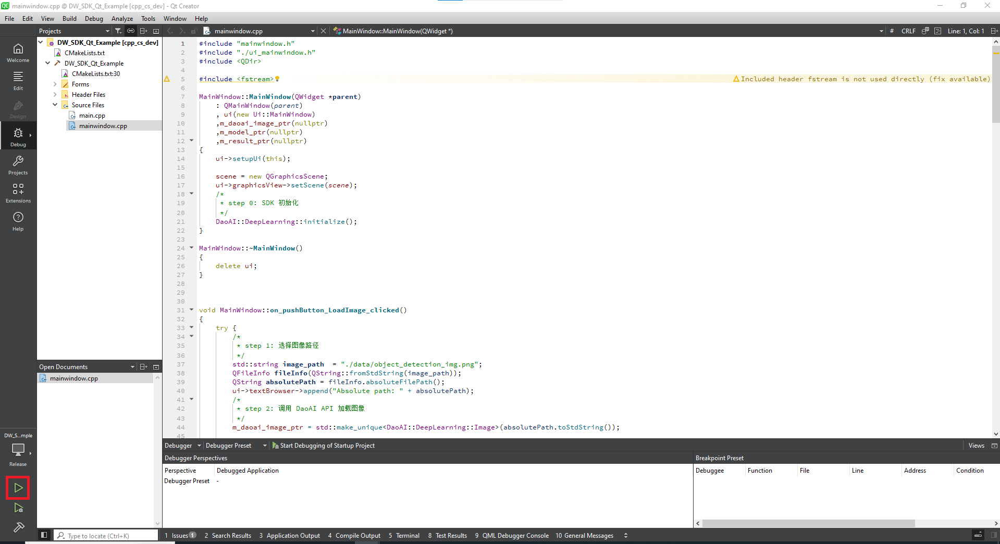  

   将数据放置到您的 Build 目录下，例如：  
   `DW_SDK_Qt_Example\build\Desktop_Qt_6_5_3_MSVC2019_64bit-Release\bin\data`  
   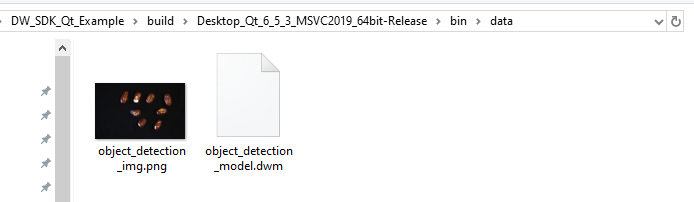

   然后依次点击按钮，使用模型推理并获取结果：  
   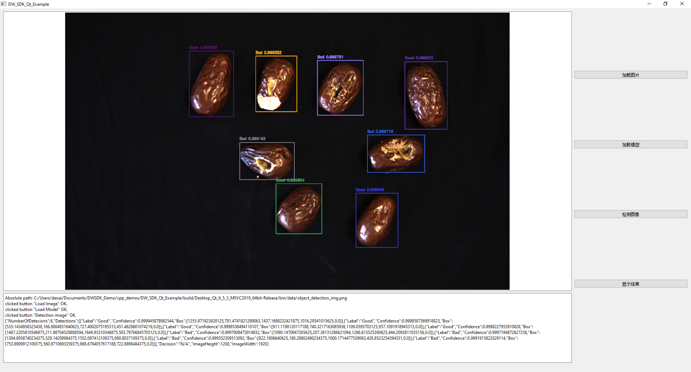

---

## **新项目配置**

### **Qt 安装与新建项目**

#### 1. 安装 Qt（以 Qt6 为例）  
按照官网指南正确安装 Qt。

#### 2. 新建 Qt 项目  
打开 QtCreator，新建一个项目，选择 **Qt Widgets Application**：  
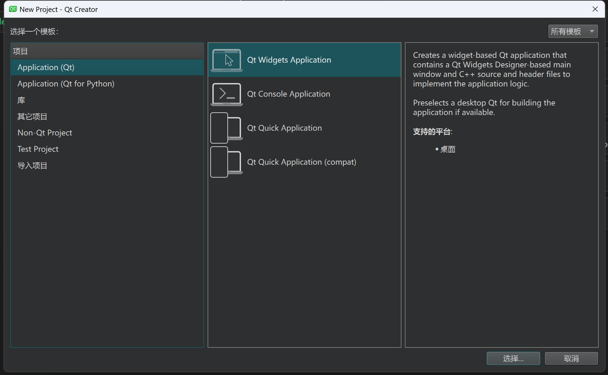

#### 3. 设置项目名称与路径  
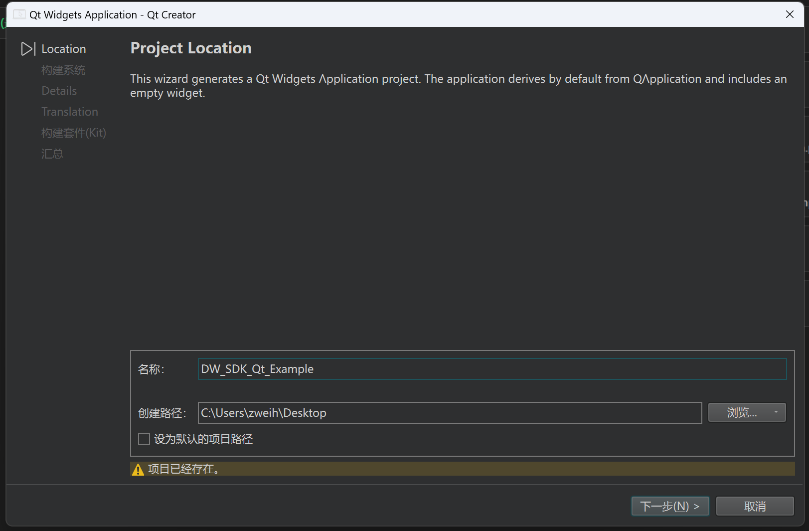

#### 4. 选择构建系统为 CMake  
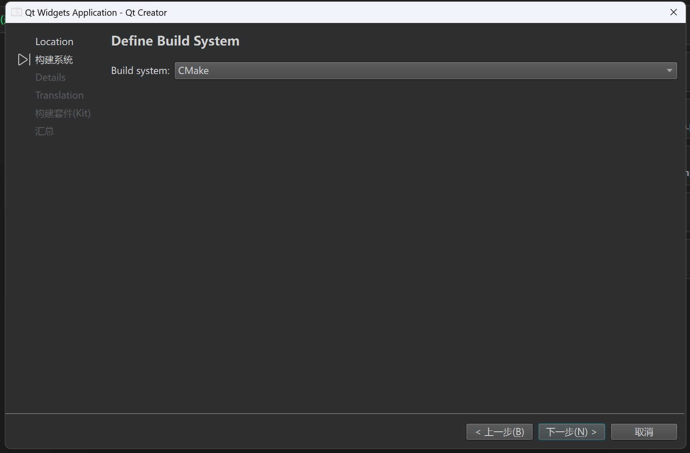

#### 5. 完成构建  
点击“下一步”完成构建。  
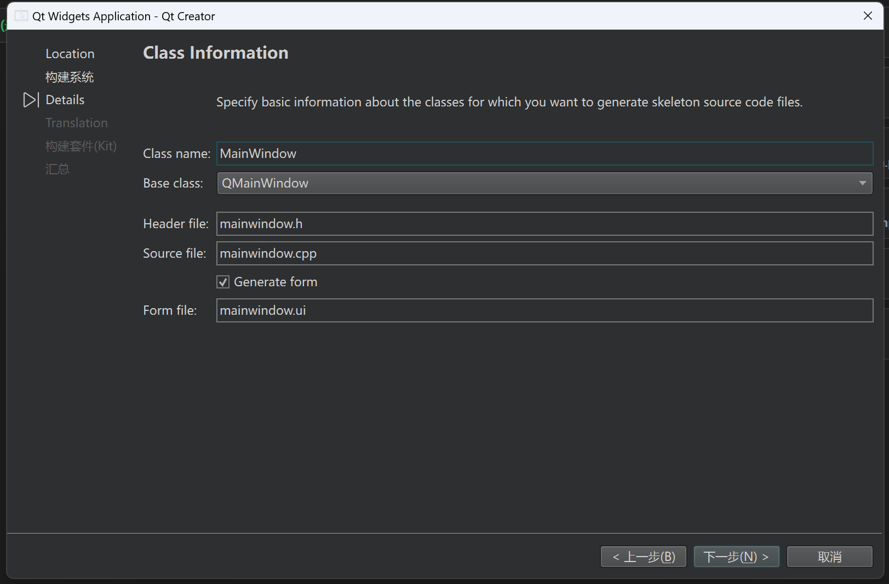

---

### **选择 MSVC2019 构建套件**

#### 1. 设置构建套件为 MSVC2019  
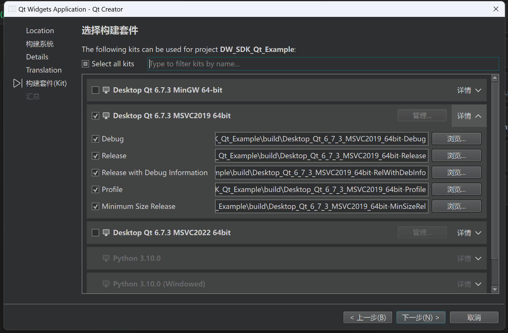

#### 2. 点击“下一步”完成配置。

---

### **生成空工程并验证环境**

1. 在生成的空工程中，选择 **Release** 模式并生成。  
2. 如果空工程生成成功，则表示 C++ 环境配置正确无误。

> **注意**：  
> 笔者使用 **Qt6** 构建工程（Qt5 亦可，CMake 配置略有不同，但操作基本一致）。

---

### **自动生成基础 `CMakeLists.txt`**

Qt 会自动生成基础的 `CMakeLists.txt`，如下所示：  
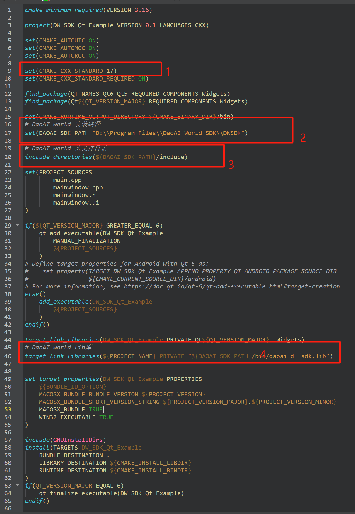

---

## **CMake 配置关键点**

在 CMake 的红框部分，请注意以下配置：  

1. 指定 C++ 标准为 **C++17**。  
2. 设置 DaoAI World SDK 的安装目录。  
3. 指定 DaoAI World SDK 的头文件目录。  
4. 指定 DaoAI World SDK 的库文件目录（Lib）。  
5. 将构建模式设为 **Release**。

---

## **完成环境配置，开始编程**

完成以上环境配置后，您即可开始编程开发。

---

# **DaoAI World SDK C++ Environment Setup**

## **1. Install the Latest DaoAI World SDK**
Please refer to the following link:  
[DW_SDK Windows Installation Package — DaoAI World User Manual 2024.8 Documentation](http://docs.welinkirt.com/daoai-world-user-manual/latest/develop/install.html#)

---

## **C++ Project Reference**
Reference Project: `DW_SDK_Cpp_Example`

### **Steps to Use the Code**
1. **Open the Project**  
   Open `DW_SDK_Cpp_Example.sln` using Visual Studio.  
   

2. **Download Data**  
   Download the [Data](https://daoairoboticsinc-my.sharepoint.com/:f:/g/personal/nrd_daoai_com/ElXWeD4qcbFLkto-NhXxgmsBlIEZ0G5iKVtdV_N0yPWfiQ?e=ViNAAL) package and extract `data.zip` into the project root directory.

3. **Select Build Configuration and Run**  
   Choose `Release x64`, select a startup project, and run the project.  
   

---

## **Qt Project Reference**
Reference Project: `DW_SDK_Qt_Example`

### **Steps to Use the Code**
1. **Open the Project**  
   Open QtCreator, select **Open Existing Project**, and choose the `CMakeLists.txt` file in the `DW_SDK_Qt_Example` folder.  
   

2. **Configure the Project**  
   Ensure the build mode is set to **Release**.  
   

3. **Run the Project**  
   Click **Run** to start the project.  
   

   Place the required data in your build directory, such as:  
   `DW_SDK_Qt_Example\build\Desktop_Qt_6_5_3_MSVC2019_64bit-Release\bin\data`  
   

   Then click the buttons in sequence to perform model inference and view the results:  
   

---

## **New Project Setup**

### **Installing and Creating a Qt Project**

#### 1. Install Qt (e.g., Qt6)  
   Follow the official documentation to install Qt.

#### 2. Create a New Qt Project  
   Open QtCreator, create a new project, and select **Qt Widgets Application**:  
   

#### 3. Set Project Name and Path  
   

#### 4. Select CMake as the Build System  
   

#### 5. Complete the Build  
   Click **Next** to finish the setup.  
   

---

### **Selecting MSVC2019 Build Kit**

#### 1. Configure MSVC2019 as the Build Kit  
   

#### 2. Click **Next** to finish the configuration.

---

### **Generate an Empty Project and Verify the Environment**

1. In the generated project, select **Release** mode and build it.  
2. If the build succeeds, your C++ environment is correctly configured.

> **Note**:  
> This guide uses **Qt6** for project setup (Qt5 is also supported, but CMake configurations might vary slightly).

---

### **Auto-Generated Basic `CMakeLists.txt`**

Qt automatically generates a basic `CMakeLists.txt`, as shown below:  

---

## **CMake Configuration Key Points**

In the highlighted sections of the CMake file, ensure the following configurations:

1. Specify the C++ standard as **C++17**.  
2. Set the installation directory for DaoAI World SDK.  
3. Add the header file directory for DaoAI World SDK.  
4. Add the library directory (`Lib`) for DaoAI World SDK.  
5. Set the build mode to **Release**.

---

## **Start Development**

With the environment successfully configured, you are ready to start development!

