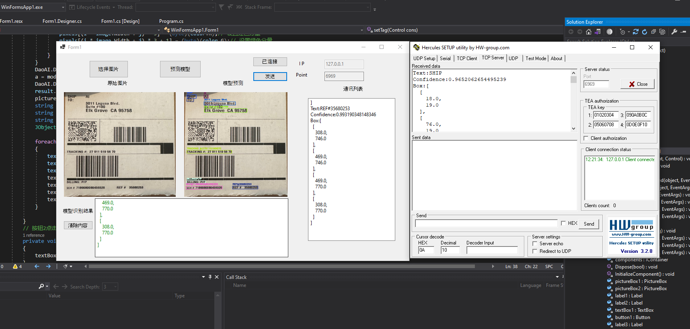

# **DWSDK C# 示例**

## **概述**
本仓库包含使用 DaoAI 的 DWSDK 的示例项目。这些示例分为以下几类：

1. **基于脚本的无窗口示例**：展示在没有图形用户界面 (GUI) 的控制台应用程序中使用模型的示例。  
   - 打开相应文件夹中的 `.sln` 文件以探索和运行这些脚本。

2. **带有 GUI 和 TCP 交互的 OCR 示例**：展示结合了 TCP 通信的 OCR 功能的图形化示例项目。详见 `WinFormsApp1/` 文件夹。

---

## **先决条件**
- **.NET SDK**：项目配置为使用 **.NET 5.0 SDK**，你也可以更改为其他 .NET 版本。

- **SDK 依赖**：添加对 `dl_sdk_net.dll` 的引用，该文件位于 **dwsdk 安装路径**的 `bin` 文件夹中。

---

## **设置说明**

### **步骤 1：打开解决方案**
1. 导航到项目文件夹（例如 `classification/` 文件夹）。
2. 使用 Visual Studio（2019 或更高版本）找到并打开 `.sln` 文件。

---

### **步骤 2：配置构建设置**
1. 将构建模式设置为 **Release**。
2. 将平台设置为 **x64**。

---

### **步骤 3：添加对 `dl_sdk_net.dll` 的引用**

1. 在 Visual Studio 中：
   - 右键单击项目并选择 **添加引用**。
   - 浏览到 `dl_sdk_net.dll` 的路径并添加它。

---

## **运行项目**

### **1. 基于脚本的示例**
- 打开所需示例的 `.sln` 文件。
- 在 **Release x64** 模式下构建并运行解决方案。

### **2. OCR GUI 示例**
- 打开 OCR 示例的 `.sln` 文件。
- 确保所有依赖项已配置（包括 `dl_sdk_net.dll`）。
- 在 **Release x64** 模式下构建并运行项目。
- 按示例中展示的方式与 GUI 和 TCP 功能交互。
   
---

## **支持**
如有任何问题或疑问，请联系 DaoAI 支持团队或查阅官方文档。

---

# **DWSDK C# demo**

## **Overview**
This repository contains example projects for using models with DaoAI's DWSDK. The examples are divided into the following categories:

1. **Script-based, Windowless Examples**: Demonstrates the usage of models in a console application without a graphical user interface (GUI).  
   - Open the `.sln` file in the corresponding folder to explore and run these scripts.

2. **OCR Example with GUI and TCP Interaction**: A graphical example project showcasing OCR functionality combined with TCP communication. See WinFormsApp1/ folder

---

## **Prerequisites**
- **.NET SDK**: the project is configured with **.NET 5.0 SDK**, you can also change to other .net versions.  

- **SDK Dependency**: Add a reference to `dl_sdk_net.dll`, located in the `bin` folder of the **dwsdk installation path**.

---

## **Setup Instructions**

### **Step 1: Open the Solution**
1. Navigate to the project folder (eg. classification/ folder).
2. Locate and open the `.sln` file using Visual Studio (2019 or later).

---

### **Step 3: Configure the Build Settings**
1. Set the build mode to **Release**.
2. Set the platform to **x64**.

---

### **Step 4: Add Reference to `dl_sdk_net.dll`**

1. In Visual Studio:
   - Right-click on the project and select **Add Reference**.
   - Browse to the path of `dl_sdk_net.dll` and add it.

---

## **Running the Projects**

### **1. Script-based Examples**
- Open the `.sln` file for the desired example.
- Build and run the solution in **Release x64** mode.

### **2. OCR GUI Example**
- Open the OCR example `.sln` file.
- Ensure all dependencies are configured (including `dl_sdk_net.dll`).
- Build and run the project in **Release x64** mode.
- Interact with the GUI and TCP functionality as demonstrated in the example.
   
---

## **Support**
For any issues or questions, please contact the DaoAI support team or refer to the official documentation.
